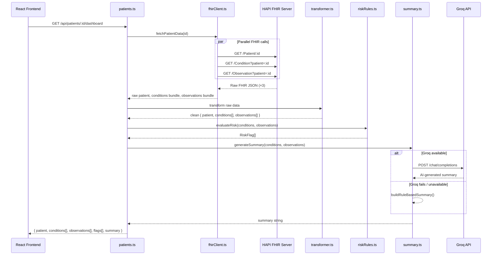
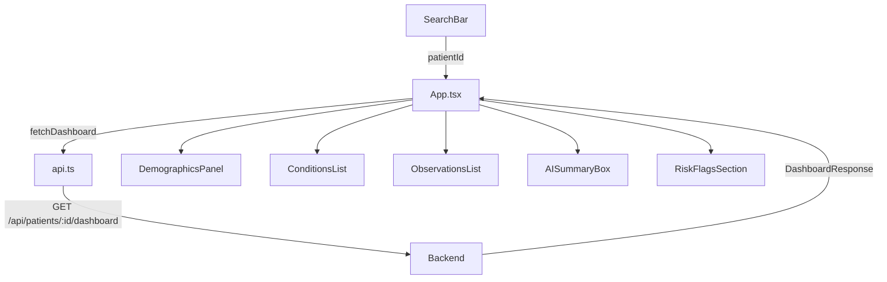

# Full-Stack Architecture — Layer Health Clinical Dashboard

**Stack:** Node.js · Express · TypeScript  
**Pattern:** Single aggregation endpoint — all patient data in one request.

---

## Why a Single Aggregation Endpoint?

| Approach                         | Trade-off                                                                      |
| -------------------------------- | ------------------------------------------------------------------------------ |
| One endpoint per resource        | More round trips from the frontend, more complex loading state                 |
| **Single `/dashboard` endpoint** | **Frontend makes 1 call, backend fans out in parallel, returns unified shape** |

The backend fetches **Patient + Condition + Observation** via `fhirClient`, pipes data through a service chain (`transformer` → `riskRules` → `summary`), and returns a single clean JSON object. The AI summary uses Groq with a rule-based fallback.

---

## Folder Structure

```
backend/
└── src/
    ├── index.ts                     # Entry point — Express setup + server start
    ├── routes/
    │   └── patients.ts              # GET /api/patients/:id/dashboard
    ├── services/
    │   ├── fhirClient.ts            # Axios calls to HAPI FHIR — only file touching the API
    │   ├── transformer.ts           # Maps raw FHIR bundles → clean dashboard types
    │   ├── riskRules.ts             # Pure sync rule evaluator → RiskFlag[]
    │   └── summary.ts               # Groq AI summary + rule-based fallback
    └── types/
        ├── fhir.ts                  # Raw FHIR resource shapes (Patient, Condition, Observation)
        └── dashboard.ts             # Clean output types (DashboardResponse, RiskFlag, etc.)
```

> [!TIP]
> No `controllers/` or `utils/` layer needed — the route handler calls the service chain directly, keeping the codebase flat and easy to navigate.

---

## Request Flow



**Step-by-step:**

1. Frontend calls `GET /api/patients/:id/dashboard`
2. `patients.ts` route handler validates `:id`
3. `fhirClient.ts` fires **3 parallel requests** (`Promise.all`) to HAPI FHIR
4. `transformer.ts` maps raw FHIR bundles → clean typed objects
5. `riskRules.ts` evaluates threshold + condition rules → `RiskFlag[]` (sync)
6. `summary.ts` calls Groq API → on any failure, falls back to `buildRuleBasedSummary()`
7. Route handler assembles `{ patient, conditions, observations, flags, summary }` and responds

---

## Key Files — Responsibilities

| File             | Responsibility                                                                             |
| ---------------- | ------------------------------------------------------------------------------------------ |
| `index.ts`       | Express app setup, middleware, mounts routes, starts server                                |
| `patients.ts`    | Route handler — validates `:id`, runs service chain, sends response                        |
| `fhirClient.ts`  | Parallel axios calls to HAPI FHIR for Patient, Condition, Observation                      |
| `transformer.ts` | Maps raw FHIR bundles → clean typed objects using `dashboard.ts` types                     |
| `riskRules.ts`   | Pure sync function — threshold + condition rules → `RiskFlag[]`                            |
| `summary.ts`     | `generateSummary()` → Groq first, `buildRuleBasedSummary()` fallback on failure            |
| `fhir.ts`        | Raw FHIR resource shapes (input types from HAPI FHIR)                                      |
| `dashboard.ts`   | Clean output types: `Patient`, `Condition`, `Observation`, `RiskFlag`, `DashboardResponse` |

---

## Unified Response Shape

```json
GET /api/patients/592924/dashboard

{
  "patient": {
    "id": "592924",
    "name": "Jane Smith",
    "gender": "female",
    "birthDate": "1990-07-22"
  },
  "conditions": [
    {
      "id": "...",
      "display": "Hypertension",
      "status": "active",
      "onsetDate": "2019-05-01"
    }
  ],
  "observations": [
    {
      "id": "...",
      "display": "Blood Pressure",
      "value": 152,
      "unit": "mmHg",
      "effectiveDate": "2024-10-15"
    }
  ],
  "summary": "Jane Smith has 1 active condition including Hypertension. Recent observations indicate a blood pressure of 152 mmHg recorded in October 2024.",
  "flags": [
    {
      "type": "HIGH_BLOOD_PRESSURE",
      "severity": "HIGH",
      "message": "Systolic BP 152 mmHg exceeds safe threshold (>140 mmHg)"
    },
    {
      "type": "HYPERTENSION_ACTIVE",
      "severity": "MEDIUM",
      "message": "Active condition: Hypertension"
    }
  ]
}
```

> [!NOTE]
> `summary` is always present. If Groq is unavailable or fails, the rule-based fallback generates it automatically.
> `flags` is always an array — empty `[]` means no risks detected.

---

## TypeScript Types

```
RiskFlag          { type: string, severity: 'HIGH' | 'MEDIUM' | 'LOW', message: string }
Patient           { id, name, gender, birthDate }
Condition         { id, display, status, onsetDate }
Observation       { id, display, value, unit, effectiveDate }
DashboardResponse { patient: Patient, conditions: Condition[], observations: Observation[], summary: string, flags: RiskFlag[] }
```

---

## Environment Variables (`.env`)

```
FHIR_BASE_URL=https://hapi.fhir.org/baseR4
PORT=5000
GROQ_API_KEY=your_groq_api_key_here
```

> [!NOTE]
> HAPI FHIR is a public test server — no auth required for development.

---

## Dependency List (planned)

| Package                                        | Purpose                              |
| ---------------------------------------------- | ------------------------------------ |
| `express`                                      | HTTP server                          |
| `cors`                                         | Allow frontend cross-origin requests |
| `axios`                                        | FHIR HTTP calls                      |
| `groq-sdk`                                     | Groq API client for AI summaries     |
| `dotenv`                                       | Env config                           |
| `typescript`                                   | Type safety                          |
| `ts-node` / `nodemon`                          | Dev server with auto-reload          |
| `@types/express`, `@types/node`, `@types/cors` | Type definitions                     |

---

## Frontend Architecture

**Stack:** React · TypeScript · Vite

### Folder Structure

```
frontend/src/
├── main.tsx                      # Entry point
├── App.tsx                       # Root — owns state, triggers API call, renders panels
├── components/
│   ├── SearchBar.tsx             # ID input + submit button
│   ├── DemographicsPanel.tsx     # Patient name, gender, DOB
│   ├── ConditionsList.tsx        # Conditions with active/inactive status badge
│   ├── ObservationsList.tsx      # Observations with value + unit
│   ├── AISummaryBox.tsx          # AI or rule-based summary paragraph
│   └── RiskFlagsSection.tsx      # Flag cards coloured by severity
├── services/
│   └── api.ts                    # fetchDashboard(id) → GET /api/patients/:id/dashboard
└── types/
    └── dashboard.ts              # Mirrors backend types: DashboardResponse, RiskFlag, etc.
```

### Data Flow



### Component Responsibilities

| Component           | Props            | Renders                                     |
| ------------------- | ---------------- | ------------------------------------------- |
| `SearchBar`         | `onSearch(id)`   | Text input + Search button                  |
| `DemographicsPanel` | `patient`        | Name, gender, DOB card                      |
| `ConditionsList`    | `conditions[]`   | List rows with active/inactive status badge |
| `ObservationsList`  | `observations[]` | List rows with value + unit                 |
| `AISummaryBox`      | `summary`        | Summary paragraph with AI label             |
| `RiskFlagsSection`  | `flags[]`        | Flag cards: 🔴 HIGH / 🟡 MEDIUM / 🟢 LOW    |

### App State

| State       | Type                        | Purpose                   |
| ----------- | --------------------------- | ------------------------- |
| `dashboard` | `DashboardResponse \| null` | Fetched data              |
| `loading`   | `boolean`                   | Show spinner during fetch |
| `error`     | `string \| null`            | Show error if fetch fails |

### Frontend Dependencies (planned)

| Package      | Purpose              |
| ------------ | -------------------- |
| `react`      | UI framework         |
| `vite`       | Dev server + bundler |
| `axios`      | API calls to backend |
| `typescript` | Type safety          |
