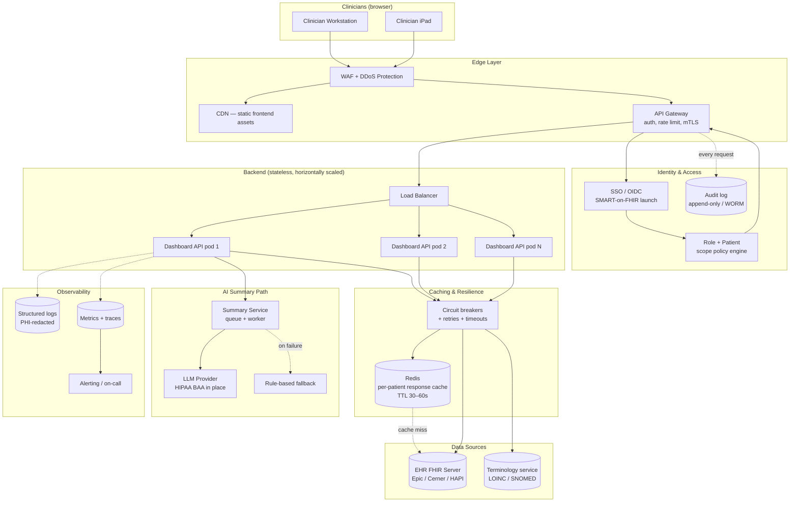

# Layer Health — Clinical Dashboard

A full-stack clinical dashboard that ingests FHIR R4 patient data, applies rule-based risk evaluation, and generates AI-assisted summaries for clinicians.

> **Stack:** Node.js · Express · TypeScript · React · Vite · Tailwind CSS · Groq (LLaMA 3.1) · FHIR R4 (HAPI)

---

## Table of Contents

1. [Quick Start](#quick-start)
2. [Project Structure](#project-structure)
3. [Design Decisions](#design-decisions)
4. [Clinical Logic](#clinical-logic)
5. [Production Architecture (Scaled)](#production-architecture-scaled)
6. [API Contract](#api-contract)
7. [Configuration](#configuration)

---

## Quick Start

### Prerequisites

- **Node.js 20+** and **npm 10+**
- A free **Groq API key** (optional — the app falls back to a deterministic rule-based summary if absent or rate-limited): <https://console.groq.com>

### 1. Clone & install

```bash
git clone <repo-url>
cd "layer health"

# Backend
cd backend
npm install

# Frontend
cd ../frontend
npm install
```

### 2. Configure environment

Create `backend/.env`:

```bash
FHIR_BASE_URL=https://hapi.fhir.org/baseR4
PORT=3001
USE_MOCK_DATA=true
GROQ_API_KEY=gsk_your_groq_key_here
```

| Variable         | Purpose                                                                                       | Default                          |
| ---------------- | --------------------------------------------------------------------------------------------- | -------------------------------- |
| `PORT`           | Backend HTTP port                                                                             | `3001`                           |
| `FHIR_BASE_URL`  | HAPI FHIR base URL (only used when `USE_MOCK_DATA=false`)                                     | `https://hapi.fhir.org/baseR4`   |
| `USE_MOCK_DATA`  | `true` reads from `backend/src/mock-data/*.json`; `false` calls live HAPI FHIR                | `true`                           |
| `GROQ_API_KEY`   | If set, summaries are AI-generated; otherwise the rule-based fallback runs silently           | unset                            |

The frontend has its own `frontend/.env` (already created) with `VITE_API_BASE_URL=http://localhost:3001`.

### 3. Run both servers

In two terminals:

```bash
# Terminal 1 — backend (hot-reload via ts-node-dev)
cd backend && npm run dev
# → Server running on http://localhost:3001

# Terminal 2 — frontend (Vite)
cd frontend && npm run dev
# → http://localhost:5173 (or 5174 if 5173 is busy)
```

### 4. Open the app

Browse to the frontend URL and search any of the demo patient IDs:

| ID         | Profile                                                                            | Expected risk flags                  |
| ---------- | ---------------------------------------------------------------------------------- | ------------------------------------ |
| `demo-001` | 33F, no conditions, normal vitals                                                  | none                                 |
| `demo-002` | 57M, active hypertension + type 2 diabetes, BP 132/86                              | 1 MEDIUM observation + 2 conditions  |
| `demo-003` | 70F, active MI + COPD (resolved HTN ignored), BP 156/98, HR 108, SpO₂ 88, temp 38.7 | 4 HIGH + 2 MEDIUM                    |

Or hit the API directly:

```bash
curl -s http://localhost:3001/api/patients/demo-002/dashboard | jq .
```

### 5. (Optional) Switch to live HAPI FHIR

Set `USE_MOCK_DATA=false` in `backend/.env`, restart the backend, then search any real HAPI patient ID (e.g. `592924`). All other code stays unchanged — only `fhirClient.ts` swaps its data source.

---

## Project Structure

```
layer health/
├── README.md                          # ← this file
├── ARCHITECTURE.md                    # detailed architecture doc
├── IMPLEMENTATION_PLAN.md             # build plan + verification steps
│
├── backend/
│   └── src/
│       ├── index.ts                   # Express entry point
│       ├── routes/
│       │   └── patients.ts            # GET /api/patients/:id/dashboard
│       ├── services/
│       │   ├── fhirClient.ts          # mock JSON OR live HAPI (toggled by USE_MOCK_DATA)
│       │   ├── transformer.ts         # raw FHIR → clean dashboard types
│       │   ├── riskRules.ts           # pure sync rule evaluator → RiskFlag[]
│       │   └── summary.ts             # Groq LLM + rule-based fallback
│       ├── mock-data/
│       │   ├── patients.json          # FHIR R4 Patient resources
│       │   ├── conditions.json        # FHIR R4 Condition bundles
│       │   └── observations.json      # FHIR R4 Observation bundles
│       └── types/
│           ├── fhir.ts                # raw FHIR resource shapes
│           └── dashboard.ts           # clean output types
│
└── frontend/
    └── src/
        ├── main.tsx
        ├── App.tsx                    # state + composition
        ├── services/api.ts            # fetchDashboard(id)
        ├── types/dashboard.ts         # mirrors backend dashboard types
        └── components/
            ├── SearchBar.tsx
            ├── DemographicsPanel.tsx
            ├── ConditionsList.tsx
            ├── ObservationsList.tsx
            ├── AISummaryBox.tsx
            └── RiskFlagsSection.tsx
```

---

## Design Decisions

### Tech Stack Rationale

| Choice                         | Why                                                                                                                                                |
| ------------------------------ | -------------------------------------------------------------------------------------------------------------------------------------------------- |
| **TypeScript everywhere**      | The same `dashboard.ts` types are mirrored on both sides — the wire format is statically checked end-to-end. No `any` allowed in the codebase.     |
| **Express on Node.js**         | Minimal, well-understood, easy to deploy. The work is mostly I/O fan-out + transformation, not heavy compute, so Node's event loop is a good fit.  |
| **Vite + React 19**            | Sub-second HMR and a tiny dev footprint. React for the component model; no framework lock-in beyond that.                                          |
| **Tailwind CSS**               | Utility-first lets clinical UI stay consistent (typography, spacing, severity colors) without bespoke CSS. No design system overhead.              |
| **Groq (LLaMA 3.1)**           | Free tier, very low latency (sub-500ms summaries), drop-in OpenAI-compatible client. Critical: **summary failures never block the response.**       |
| **FHIR R4 + HAPI**             | Industry standard. Mock data is authored as real FHIR resources so swapping back to live HAPI is a one-line config change.                         |
| **No database**                | The system is a stateless aggregator over an external system of record (FHIR). Adding a DB would shift the source of truth — out of scope.         |

### Backend → Frontend Communication

A **single aggregation endpoint** instead of one endpoint per FHIR resource:

```
GET /api/patients/:id/dashboard
   ↳ returns { patient, conditions[], observations[], summary, flags[] }
```

| Trade-off                            | Decision                                                                                                                                                          |
| ------------------------------------ | ----------------------------------------------------------------------------------------------------------------------------------------------------------------- |
| One round trip vs three              | One. The frontend is simple; loading states, error handling, and partial-failure logic all collapse into a single `try/catch`.                                    |
| Server-side fan-out vs client-side   | Server. The backend issues 3 parallel FHIR calls via `Promise.all`. From a clinician's browser (potentially over hospital Wi-Fi) this is much faster than 3 HTTP hops. |
| Where to compute risk flags          | Server, in a pure sync function (`riskRules.ts`). Rules live in config arrays, not branching logic — adding a new threshold is a one-line change.                 |
| Where the LLM call lives             | Server. Keeps the API key off the client and lets us guarantee a fallback if Groq is down.                                                                        |

### Service Chain (single-responsibility per file)

```
fhirClient → transformer → riskRules → summary
   raw         clean         sync          AI/fallback
```

- `fhirClient.ts` — **only** file that reads patient data. Either pulls from `mock-data/*.json` or makes axios calls to HAPI. Same return signatures either way, so the rest of the chain is source-agnostic.
- `transformer.ts` — defensively maps FHIR (which is full of optional fields) to clean types. Every nested access uses optional chaining + a fallback.
- `riskRules.ts` — pure, sync, no I/O. Easy to unit-test, easy to extend.
- `summary.ts` — calls Groq; on **any** failure (network, rate limit, malformed response) silently falls back to a rule-based summary. The summary endpoint never throws.

---

## Clinical Logic

### Why these data points?

The dashboard surfaces the **shortest possible context a clinician needs to triage a patient in under 30 seconds**:

| Panel              | Why it's there                                                                                                                                                            |
| ------------------ | ------------------------------------------------------------------------------------------------------------------------------------------------------------------------- |
| **Demographics**   | Identity confirmation. Age (computed from `birthDate`) is clinically relevant for almost every threshold (e.g. paediatric vs adult vitals).                                 |
| **Risk Flags**     | The headline. A clinician should see "what's wrong with this patient right now" before reading anything else. Sorted HIGH → MEDIUM → LOW. Empty state is explicitly green. |
| **AI Summary**     | A 2–3 sentence narrative the clinician can read aloud during handoff. Rule-based fallback ensures it's always present.                                                    |
| **Conditions**     | Active diagnoses with onset dates. Resolved conditions are shown but visually de-emphasised (and are excluded from risk flagging).                                        |
| **Observations**   | Most recent vitals with units. Currency matters more than completeness — the table is short, scannable, and value-aligned.                                                |

### What the risk rules check

Threshold rules (LOINC-coded vitals):

| Code      | Vital                      | HIGH                | MEDIUM                |
| --------- | -------------------------- | ------------------- | --------------------- |
| `8480-6`  | Systolic BP                | > 140 mmHg          | 120–140 mmHg          |
| `8867-4`  | Heart rate                 | > 100 bpm           | < 60 bpm              |
| `2708-6`  | O₂ saturation              | < 90%               | 90–94%                |
| `8310-5`  | Body temperature           | —                   | > 38.5 °C (fever)     |

Condition rules (SNOMED-coded, only if `clinicalStatus = active`):

| Code         | Condition                  | Severity |
| ------------ | -------------------------- | -------- |
| `22298006`   | Myocardial infarction      | HIGH     |
| `38341003`   | Hypertension               | MEDIUM   |
| `44054006`   | Type 2 diabetes mellitus   | MEDIUM   |
| `73211009`   | Diabetes mellitus          | MEDIUM   |
| `13645005`   | COPD                       | MEDIUM   |

> **Resolved conditions are intentionally ignored** — `riskRules.checkConditions` filters on `status === "active"` so a patient with historical (but treated) hypertension does not generate a current flag. This matches how clinicians read a problem list.

### How this fits a clinical workflow

This dashboard is designed for the **chart-open glance** — the 10–30 seconds between a clinician clicking a patient's name and starting to talk to them.

1. **Triage at glance** — the right column is the risk panel. Severity-coloured cards mean a clinician sees red before they read anything.
2. **Confirm context** — demographics + AI summary together answer "who is this and what's going on?"
3. **Drill in** — conditions and observations tables provide the supporting detail the clinician needs to confirm or dismiss the flagged risks.
4. **Resilience by default** — if the LLM is down or slow, the rule-based summary still appears; if HAPI returns a sparse record, every transformer falls back to safe defaults rather than crashing the page.

This is intentionally **not** a charting system, an order-entry system, or a longitudinal record viewer. Those are separate problems; this dashboard is a focused triage/handoff aid.

---

## Production Architecture (Scaled)

The current code is a single backend process talking to a single FHIR server. Here is how the same service chain would be deployed to support **thousands of concurrent clinicians** with the security and reliability a clinical environment demands.



### What changes vs. the current code

| Concern              | Today                                  | Production                                                                                                                |
| -------------------- | -------------------------------------- | ------------------------------------------------------------------------------------------------------------------------- |
| **Auth**             | Open (CORS only)                       | OIDC / **SMART-on-FHIR** launch context. Every request carries a clinician identity + patient scope claim.                 |
| **Authorization**    | None                                   | Policy engine (e.g. OPA) checks "may this clinician see this patient?" against a role + relationship matrix.              |
| **Network**          | Localhost                              | Edge: WAF + DDoS, mTLS between gateway and services, private VPC, no public ingress to the FHIR layer.                    |
| **Audit**            | None                                   | Every read is audited (clinician, patient, timestamp, IP) to an append-only / WORM store — required by HIPAA `§164.312`. |
| **Scaling**          | One process                            | Stateless API pods behind a load balancer. HPA scales on CPU + p95 latency. Zero session affinity needed.                 |
| **FHIR latency**     | 3 round trips per request              | Same fan-out, but with a per-patient **Redis cache** (30–60s TTL) — drops most clinician click-to-render to single-digit ms. |
| **Resilience**       | Inline `try/catch`                     | Circuit breakers + bounded retries + per-call timeouts on FHIR and LLM. The rule-based summary becomes a real failover.    |
| **LLM**              | Direct synchronous call to Groq        | Provider with a signed HIPAA BAA. Optional async path via a queue if response time matters less than throughput.          |
| **PHI in logs**      | Possible (we log errors verbatim)      | Structured logging with PHI redaction at the logger; correlation IDs tie a request across services without leaking names.  |
| **Observability**    | Console logs                           | Metrics (RED), traces (OpenTelemetry), error tracking (Sentry), alerts on FHIR error rate, LLM error rate, p95 latency.    |
| **Deployment**       | `npm run dev`                          | Container images, immutable releases, blue/green or canary deploys, infra as code (Terraform / Pulumi).                     |
| **Compliance**       | —                                      | HIPAA technical safeguards, SOC 2 controls, encryption at rest (KMS) + in transit (TLS 1.3), regular access reviews.       |

The **service chain itself does not change** — `fhirClient → transformer → riskRules → summary` is identical in production. That's the point of keeping each file single-purpose: every concern above is added at the edges, not by rewriting the business logic.

---

## API Contract

Single endpoint:

```
GET /api/patients/:id/dashboard
```

**Response (200 OK):**

```json
{
  "patient":      { "id", "name", "gender", "birthDate" },
  "conditions":   [{ "id", "code", "display", "status", "onsetDate" }],
  "observations": [{ "id", "code", "display", "value", "unit", "effectiveDate" }],
  "summary":      "string — always present (AI-generated or rule-based fallback)",
  "flags":        [{ "type", "severity", "message" }]
}
```

- `severity` ∈ `"HIGH" | "MEDIUM" | "LOW"`
- `flags` is always an array; `[]` means no risks detected.
- `summary` is always a non-empty string.

**Error responses:**

| Status | Body                                 | Cause                          |
| ------ | ------------------------------------ | ------------------------------ |
| 400    | `{ "error": "Patient ID is required" }` | Missing `:id`                  |
| 404    | `{ "error": "Patient {id} not found" }` | No matching FHIR Patient       |
| 500    | `{ "error": "Failed to fetch patient dashboard" }` | Upstream FHIR or other failure |

Health probe:

```
GET /health  →  { "status": "ok" }
```

---

## Configuration

| File                                | Purpose                                              |
| ----------------------------------- | ---------------------------------------------------- |
| `backend/.env`                      | Backend secrets + flags (gitignored)                 |
| `frontend/.env`                     | `VITE_API_BASE_URL` for the frontend (gitignored)    |
| `backend/src/mock-data/*.json`      | Demo FHIR resources used when `USE_MOCK_DATA=true`   |
| `backend/src/services/riskRules.ts` | Threshold + condition rules (config arrays)          |

To add a new clinical rule, edit the `OBSERVATION_RULES` or `CONDITION_RULES` arrays in `riskRules.ts` — no other file needs to change.

---

## License

Proprietary — Layer Health.
